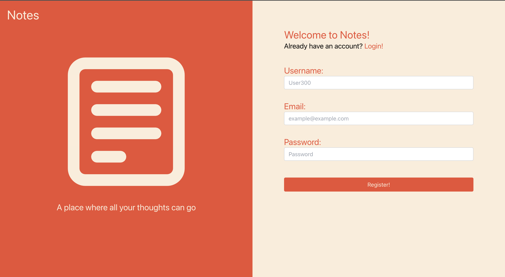
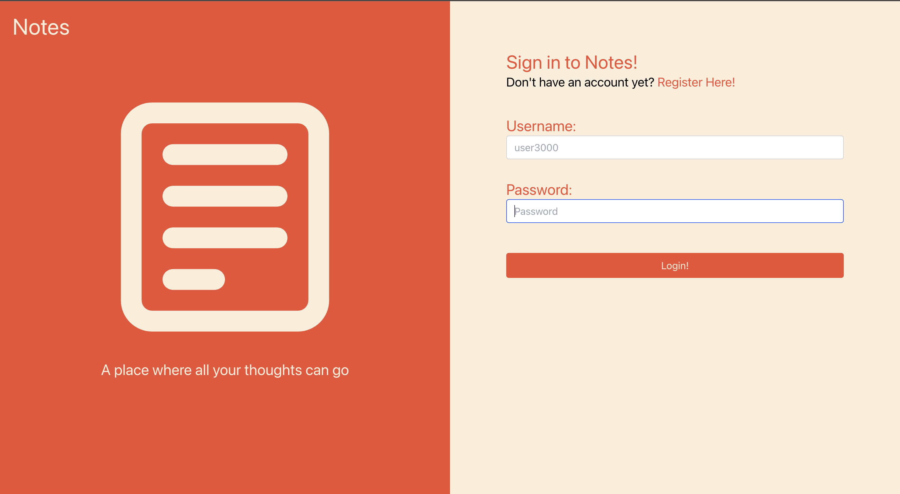
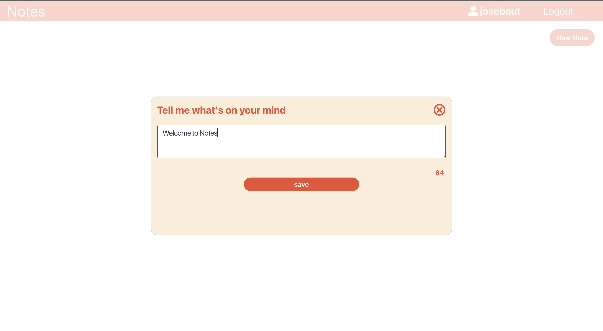
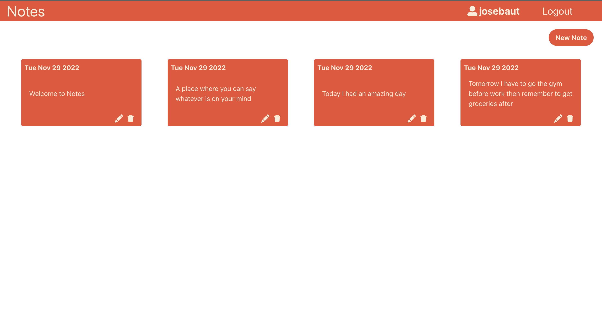

# Welcome to Notes

## About

Notes is a simple application that allows a user to create quick notes on whatever is on there mind. 

- [Motivation](#motivation)
- [Challenges](#challenges)
- [Tech Stack](#tech-stack)

## Project Pictures

#### Register

#### Login

#### New Note

#### Home

## Motivation

Notes started off just like any other project, just an idea. As I gave it more thought I decided I wanted to create an application that had users and user data. Notes allows to demonstrate that I'm able to understand how a full-stack application is built.

## Challenges
Some of the challenges I faced were:
- thinking of how the notes were going to relate to the users
- working with MongoDB because it was my first time using it (lots of googling and documentation)
- Handling the authentication instead of using a library

## Tech Stack

- Front-end: JavaScript, React, TailWindCSS, React-Router-DOM, React-modal
- Back-end: JavaScript, Node, Express, Mongoose, Bcrypt, CORS

### Database

- MongoDB